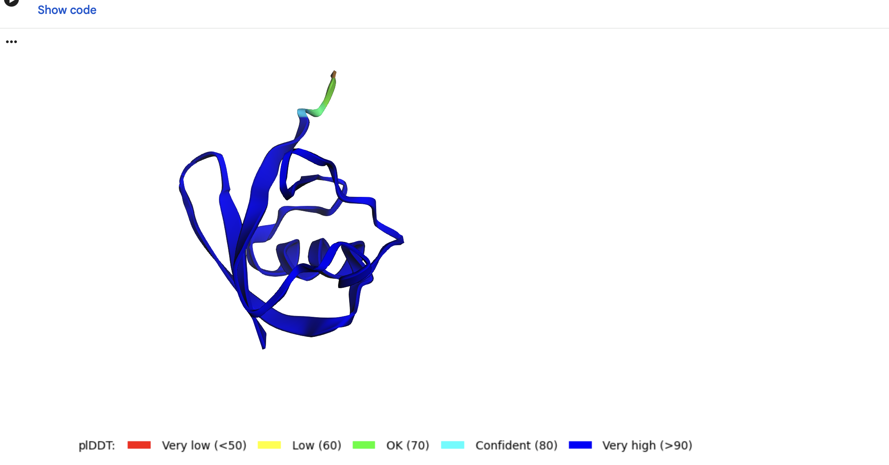
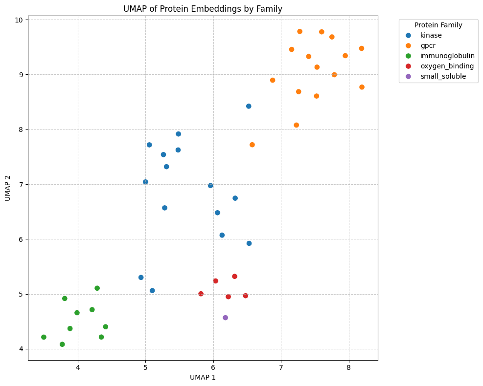

# Week 3 Results

Use this file for the short Week 3 write-up. Keep it factual: what ran, what failed, what you checked, and what you would trust.

## Exercise A: Structure Prediction

- **Tool or notebook:** ColabFold v1.6.1 (AlphaFold2, the `alphafold2_ptm` model) run in Google Colab. Default settings: 3 recycles, no templates, no relax.
- **Sequence or target:** Human ubiquitin, a small 76-amino-acid protein (`MQIFVKTLTGKTITLEVEPSDTIENVKAKIQDKEGIPPDQQRLIFAGKQLEDGRTLSDYNIQKESTLHLVLRLRGG`).
- **Mean pLDDT:** AlphaFold built 5 candidate models and ranked them. The best one (`rank_001`) scored **pLDDT = 96** and **pTM = 0.843** — very high confidence. (pLDDT is the per-residue confidence score from 0–100; pTM is a 0–1 score for whether the overall fold is right.)
- **Low-confidence regions:** In the "colored by pLDDT" view almost the entire structure is dark blue (very high confidence, >90). The only lower-confidence part is the short **C-terminal tail** (the very end of the chain), which shades from cyan to green to orange. This is biologically correct: that tail is genuinely floppy in real life — it is the part of ubiquitin that attaches onto other proteins to tag them — so the model's low confidence there reflects real flexibility, not an error.
- **PAE observation, if relevant:** Not recorded in this run.
- **Would you trust this prediction for a biological claim?** For the overall fold, **yes**: the structure is almost entirely high-confidence blue, ubiquitin is a small well-known protein whose real shape is already established (a fair sanity check), and the prediction matches it. I would **not** over-trust the exact position of the floppy C-terminal tail — the low confidence there is the model flagging genuine flexibility, so a single predicted pose of that tail should not be treated as fact.

## Exercise B: Protein Embeddings

- **Model:** ESM2 (`facebook/esm2_t6_8M_UR50D`) — the smallest ESM2 (8M parameters), run via HuggingFace `transformers` in Colab.
- **Number of sequences:** 45 human proteins, grouped into 6 coarse families (kinase, GPCR, immunoglobulin, oxygen-binding, small-soluble) from `protein_accessions.tsv`.
- **Pooling choice:** CLS-token embedding — the first token's vector from the last hidden layer is used as the whole-protein representation.
- **Plot files:** `umap_by_family.png` (UMAP of the per-protein embeddings, coloured by known family).
- **Did known families cluster?** Yes. The families separated into clear, distinct regions of the UMAP: kinases form their own group, GPCRs cluster tightly in the top-right, immunoglobulins group together in the bottom-left, and the oxygen-binding proteins form a small group at the bottom. ESM2 was never given the family labels, so recovering them from sequence alone is the encouraging result. (The lone small-soluble protein, cytochrome c, sits near the oxygen-binding heme proteins, which is biologically reasonable.)
- **One validation check:** The UMAP is coloured by the known family labels, so the plot doubles as a sanity check — the colours line up with the spatial clusters. If the embeddings were uninformative, the colours would be scattered randomly instead of forming family islands. (This came for free from colouring by family rather than from a separate validation step.)

## Exercise C: Optional Genomic Benchmarks

Not attempted (this exercise was optional).

## Surprises

- **Hard-to-interpret output:** The low-confidence (non-blue) patch on the ubiquitin structure. At first it looked like the model failing on part of the protein, but it maps to the C-terminal tail, which is genuinely flexible in real life. So "low confidence" there was the model being *correct* about uncertainty, not wrong — and that distinction (unsure-because-wrong vs unsure-because-it-moves) is the tricky part to read.
- **Validation habit I'll reuse:** Don't trust a single summary score or a nice-looking picture on its own. Look at the confidence signal (pLDDT colouring on a structure, family colouring on an embedding plot) and check it lines up with what I'd expect biologically.
